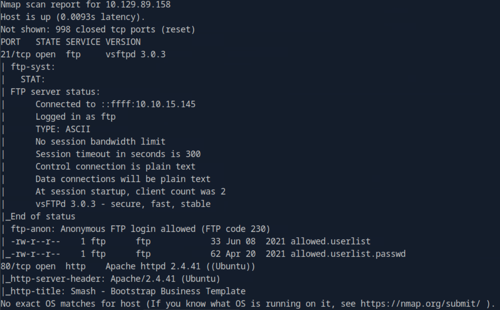
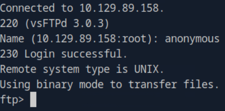
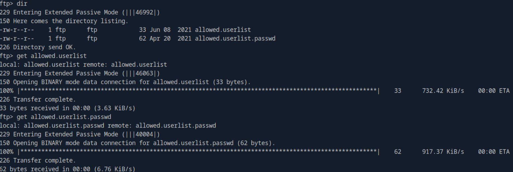
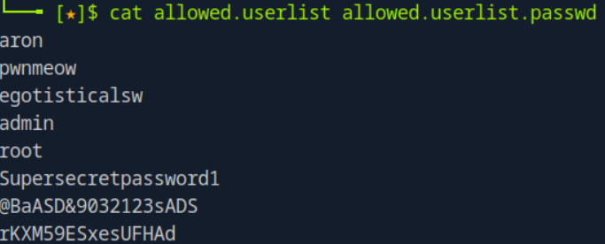
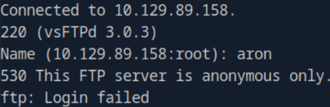
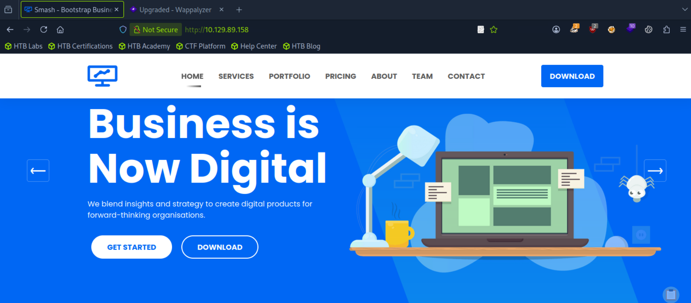
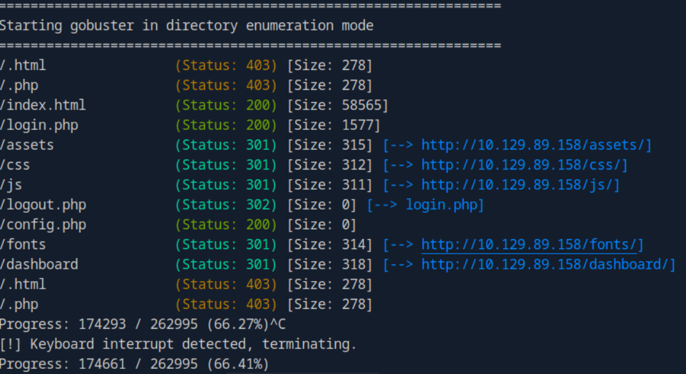
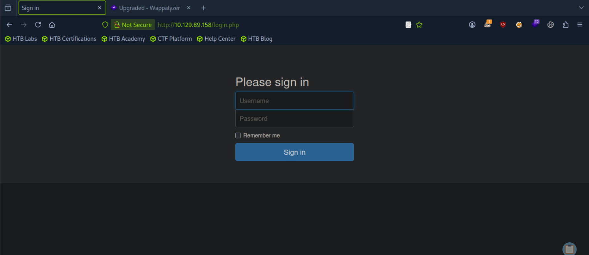
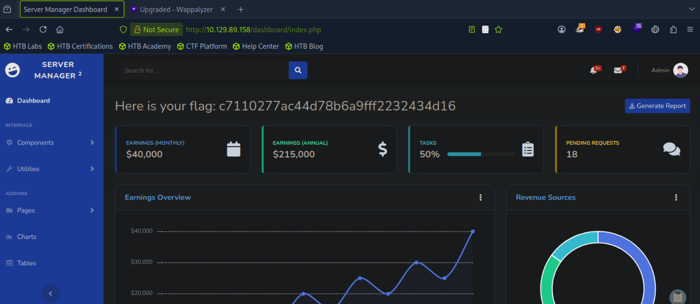

# HackTheBox-Crocodile-CTF-Walkthrough

## Introduction
  Crocodile is a vulnerable linux machine hosted by HackTheBox.com. This machine showcases the dangers of misconfigured authentication and sensitive data exposure. A vulnerable FTP server instance is misconfigured to allow anonymous authentication and upon enumerating the server, sensitive files can be found containing cleartext credentials. Enumerating and fuzzing the website will reveal a hidden login endpoint where the previously acquired credentials can be used to gain access to the admin panel.

## Machine link
Here is a link for the machine so you can try it yourself
[Crocodile - HTB](https://www.hackthebox.com/machines/crocodile)

## Walkthrough
Start by running an nmap scan on the machine to see what ports are open. Running the command below will also run default scripts, check service versions, and the operating system.
```
sudo nmap -sC -sV -O 10.129.89.158
```
This machine has two open ports; port 21 for ftp, and port 80 for http.



In this case, ftp allows anonymous login with no password. Run `ftp [ip address]`, enter anonymous as the username and leave the password blank.



To list the files on the machine, enter the command  `dir`. To download a file, use the command `get [filename]`. Once you're done, type `exit` to exit the ftp client.



List the contents of each file using cat, now you have a short list of username and passwords. If we try logging in as one of the users, you will get an error saying only anonymous can be used.





Since ftp can't use these for logging in as one of the users, lets try checking out the website on port 80.



Since there is no login page visable on the page, use gobuster to try and find any hidden url paths. These flags for gobuster will help:

- `dir` Uses directory/file enumeration mode.
- `--url` The target URL.
- `--wordlist` Path to the wordlist.
- `-x` File extension(s) to search for

Using `-x` to filter only php and html to help filter out any unnecessary cluter. 

After running:

`gobuster dir --url http://10.129.89.158/ --wordlist /usr/share/wordlists/dirbuster/directory-list-2.3-small.txt -x php,html`

This is the output. One of the pages that stuck out was login.php.



When you type `http://10.129.89.158/login.php` you arepresented with a login page.



First, try using the username admin and go through each password from allowed.userlist.passwd. One of these passwords work and you will get access and get the root flag.


